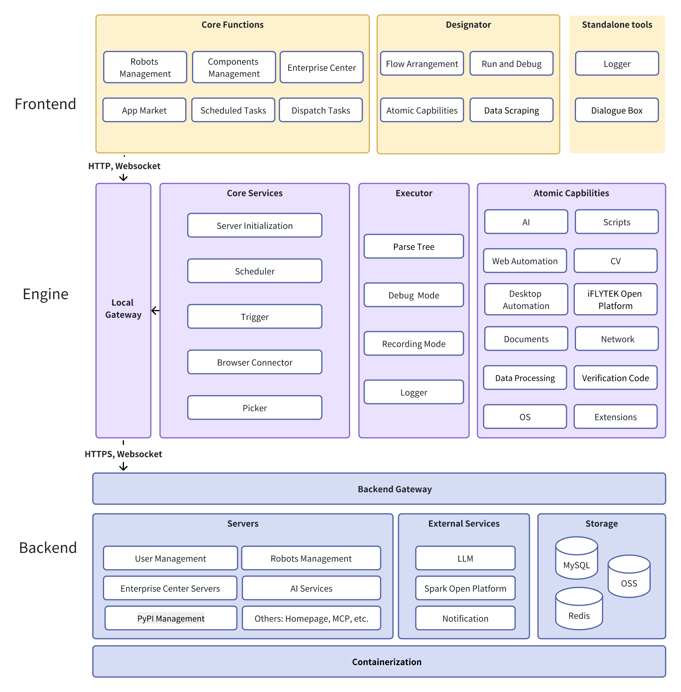

# AstronRPA

<div align="center">


**🤖 Enterprise-grade Robotic Process Automation (RPA) Development Platform**

[](LICENSE)
[](https://github.com/iflytek/astron-rpa/releases)
[](https://www.python.org/)
[](https://github.com/iflytek/astron-rpa/stargazers)

English | [简体中文](README.zh.md)

</div>

## 📑 Table of Contents

- [📋 Overview](#-overview)
- [🎯 Why Choose AstronRPA](#-why-choose-astronrpa)
- [✨ Core Features](#-core-features)
- [🛠️ Tech Stack](#-tech-stack)
- [📱 Screenshots](#-screenshots)
- [🚀 Quick Start](#-quick-start)
  - [System Requirements](#system-requirements)
  - [Using Docker](#using-docker)
  - [Source Deployment](#source-deployment)
- [📦 Component Ecosystem](#-component-ecosystem)
- [🏗️ Technical Architecture](#-technical-architecture)
- [📚 Documentation](#-documentation)
- [🤝 Contributing](#-contributing)
- [💖 Sponsorship](#-sponsorship)
- [📞 Getting Help](#-getting-help)
- [📄 License](#-license)

## 📋 Overview

AstronRPA is an all-in-one Robotic Process Automation (RPA) development tool that provides enterprises and developers with a complete RPA automation solution from design to deployment. The platform integrates comprehensive automation capabilities, rich component libraries, various development modes and frameworks, enabling developers to build powerful automation processes in the most convenient way.

AstronRPA is derived from the "iFlytek RPA Platform" which has served various industries and professional developers, and we have made its core engine completely open source. Through visual design and build tools, developers can quickly create and debug robots, applications, and workflows using no-code or low-code approaches, enabling powerful RPA application development and more customized business logic.

### 🎯 Why Choose AstronRPA?

- **🏭 Production Ready**: Mature platform serving various industries
- **🧩 Rich Components**: 300+ professional RPA component capabilities
- **👨‍💻 Developer Friendly**: Visual design + complete build documentation
- **☁️ Cloud Native**: Built on microservices architecture with containerization support
- **🔓 Open Source**: Core engine completely open source, community-driven development
- **🤖 AI Powered**: Supports integration with various large language models

## ✨ Core Features


- 🔒 **Enterprise Security** - Complete permission management, audit logs, and data encryption
- 🔧 **Easy Integration** - Rich API interfaces and configurations with multi-language support
- 📊 **Real-time Monitoring** - Complete execution status monitoring, performance metrics, and alerting system
- 📈 **Elastic Scaling** - Microservices architecture with horizontal scaling and load balancing

### 🎯 Visual Design
- Drag-and-drop process designer
- Real-time preview and debugging
- Rich component templates

### 🔧 Component-based Development
- 300+ professional RPA component capabilities
- Standardized component interfaces
- Custom component extensions
- Component version management

### 🤖 AI Empowerment
- Intelligent image picking
- OCR text extraction
- Automatic CAPTCHA recognition

### 📊 Execution Monitoring
- Real-time execution status
- Detailed logging
- Performance metrics statistics
- Exception alert notifications

### 🌐 Multi-platform Support
- Desktop local execution
- Web monitoring and viewing
- API interface integration
- MCP tool support

## 🛠️ Tech Stack

- **Frontend**: Vue 3 + TypeScript + Vite + Ant Design Vue
- **Backend Services**: Java Spring Boot + Python FastAPI
- **Data Storage**: MySQL + Redis
- **Message Queue**: Asynchronous task processing support
- **Containerization**: Docker + Docker Compose
- **Desktop App**: Tauri (Rust + Web)
- **Package Management**: pnpm + uv
- **Monitoring**: Integrated SkyWalking distributed tracing

## 🏗️ Architecture Overview



### Architecture Details

### Frontend Architecture
- **Framework**: Vue 3 + TypeScript + Vite
- **UI Components**: Ant Design Vue + VXE Table
- **State Management**: Pinia
- **Desktop App**: Tauri (Rust + Web Technologies)
- **Package Management**: pnpm workspace monorepo

### Backend Architecture
- **Main Service**: Java Spring Boot 2.3.11
- **AI Service**: Python FastAPI
- **OpenAPI Service**: Python FastAPI 
- **Resource Service**: Java Spring Boot
- **Database**: MySQL + Redis
- **Message Queue**: Support for asynchronous task processing

### Engine Architecture
- **Language**: Python 3.13+
- **Framework**: FastAPI + asyncio
- **Component Architecture**: 20+ professional RPA component types
- **Executor**: Support atomic operations, workflows, record & replay
- **Communication**: WebSocket real-time communication
- **Locating Technology**: Image recognition, OCR, UI automation

### Deployment Architecture
- **Containerization**: Docker + Docker Compose
- **Microservices**: Independent service modules, deployable separately
- **Observability**: Integrated SkyWalking distributed tracing
- **Load Balancing**: Nginx reverse proxy

## 🚀 Quick Start

### System Requirements
- **Operating System**: Windows 10/11 (primary support), macOS, Linux
- **Node.js**: >= 22
- **Python**: 3.13.x
- **Java**: JDK 8+
- **pnpm**: >= 9
- **rustc**：>= 1.90.0
- **UV**: Python package management tool
- **7-Zip**: For creating deployment archives

### Using Docker

Recommended for quick deployment:

```bash
# Clone the repository
git clone https://github.com/iflytek/astron-rpa.git
cd astron-rpa

# Enter docker directory
cd docker

# Start the container stack
docker-compose up -d

# Check service status
docker-compose ps
```

- Access the application at `http://localhost:8080`
- For production deployment and security hardening, refer to [Deployment Guide](docker/QUICK_START.md)

### Source Deployment

#### One-Click Launch (Recommended)

1. **Prepare Python Environment**
   ```bash
   # Prepare a Python 3.13.x installation directory
   # Can be a local folder or system installation path
   # The script will copy this directory to create python_core
   ```

2. **Run Build Script**
   ```bash
   # Full build (engine + frontend + desktop app) from project root directory
   ./build.bat --python-exe "C:\Program Files\Python313\python.exe"
   
   # Or use default configuration (if Python is in default path)
   ./build.bat
   
   # Wait for completion
   # Build successful when console displays "Full Build Complete!"
   ```

   > **Note:** Please ensure the specified Python interpreter is a clean installation without additional third-party packages to minimize package size.

   **Build process includes:**
   1. ✅ Detect/copy Python environment to `build/python_core`
   2. ✅ Install RPA engine dependencies
   3. ✅ Compress Python core to `resources/python_core.7z`
   4. ✅ Install frontend dependencies
   5. ✅ Build frontend web application
   6. ✅ Build Tauri desktop application

#### Development Environment

```bash
# Install dependencies
cd frontend
pnpm install

# Start web development server
pnpm dev:web

# Start Tauri desktop app (development mode)
pnpm dev:tauri

# Start backend services (need to configure database first)
cd backend/robot-service
mvn spring-boot:run
```

## 📦 Component Ecosystem

### Core Component Packages
- **astronverse.system**: System operations, process management, screenshots
- **astronverse.browser**: Browser automation, web page operations
- **astronverse.gui**: GUI automation, mouse and keyboard operations
- **astronverse.excel**: Excel spreadsheet operations, data processing
- **astronverse.vision**: Computer vision, image recognition
- **astronverse.ai**: AI intelligent service integration
- **astronverse.network**: Network requests, API calls
- **astronverse.email**: Email sending and receiving
- **astronverse.docx**: Word document processing
- **astronverse.pdf**: PDF document operations
- **astronverse.encrypt**: Encryption and decryption functions

### Execution Framework
- **astronverse.actionlib**: Atomic operation definition and execution
- **astronverse.executor**: Workflow execution engine
- **astronverse.picker**: Workflow element picker engine
- **astronverse.scheduler**: Engine scheduler
- **astronverse.trigger**: Engine trigger

### Shared Libraries
- **astronverse.baseline**: RPA framework core
- **astronverse.websocketserver**: WebSocket communication
- **astronverse.websocketclient**: WebSocket communication
- **astronverse.locator**: Element locating technology


## 📚 Documentation

- [📖 User Guide](HOW_TO_RUN.md)
- [🚀 Deployment Guide](docker/QUICK_START.md)
- [📖 API Documentation](backend/openapi-service/api.yaml)
- [🔧 Component Development Guide](engine/components/)
- [🐛 Troubleshooting](docs/TROUBLESHOOTING.md)
- [📝 Changelog](CHANGELOG.md)

## 🤝 Contributing

We welcome any form of contribution! Please check [Contributing Guide](CONTRIBUTING.md)

### Development Guidelines
- Follow existing code style
- Add necessary test cases
- Update relevant documentation
- Ensure all checks pass

### Contributing Steps
1. Fork the repository
2. Create your feature branch (`git checkout -b feature/AmazingFeature`)
3. Commit your changes (`git commit -m 'Add some AmazingFeature'`)
4. Push to the branch (`git push origin feature/AmazingFeature`)
5. Open a Pull Request

## 🌟 Star History

<div align="center">
  
</div>

## 💖 Sponsorship

<div align="center">
  <a href="https://github.com/sponsors/iflytek">
    
  </a>
  <a href="https://opencollective.com/astronrpa">
    
  </a>
</div>

## 📞 Getting Help

- 📧 Technical Support: [cbg_rpa_ml@iflytek.com](mailto:cbg_rpa_ml@iflytek.com)
- 💬 Community Discussion: [GitHub Discussions](https://github.com/iflytek/astron-rpa/discussions)
- 🐛 Bug Reports: [Issues](https://github.com/iflytek/astron-rpa/issues)

## 📄 License

This project is open source under the [Open Source License](LICENSE).

---

<div align="center">

**Developed and maintained by iFlytek**

[](https://github.com/iflytek)
[](https://github.com/iflytek/astron-rpa)
[](https://github.com/iflytek/astron-rpa/fork)
[](https://github.com/iflytek/astron-rpa/watchers)

**AstronRPA** - Making RPA development simple and powerful!

If you find this project helpful, please give us a ⭐ Star!

</div>