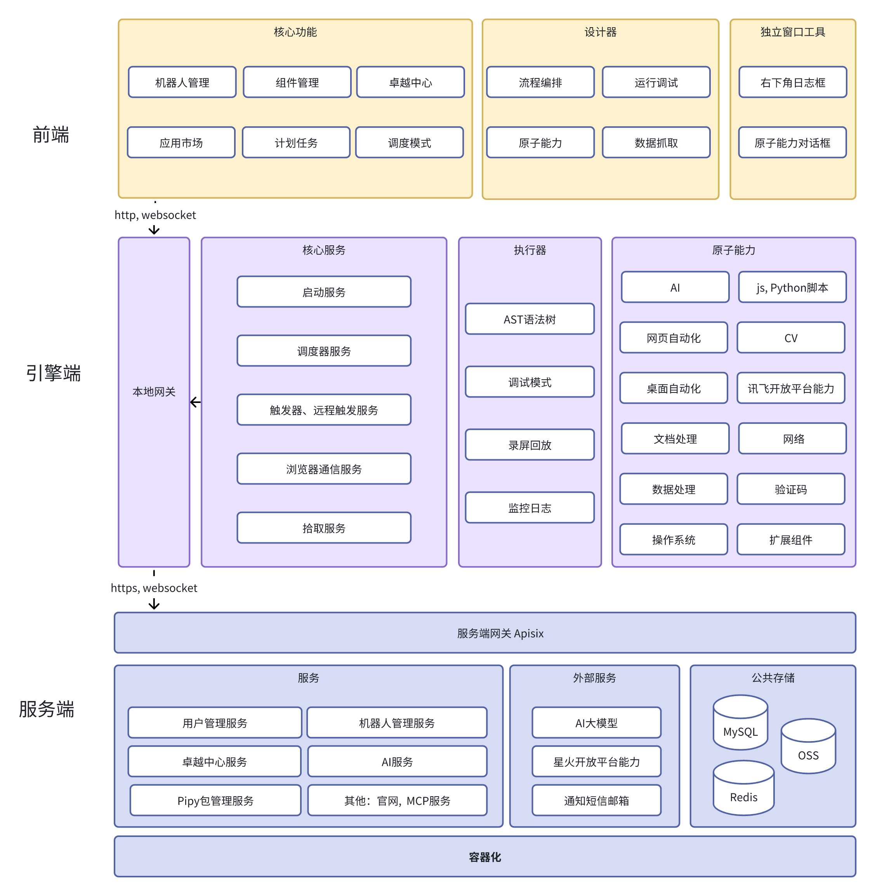

# AstronRPA

<div align="center">


**🤖 企业级机器人流程自动化（RPA）开发平台**

[](LICENSE)
[](https://github.com/iflytek/astron-rpa/releases)
[](https://www.python.org/)
[](https://github.com/iflytek/astron-rpa/stargazers)

[English](README.md) | 简体中文

</div>

## 📑 目录

- [📋 概述](#-概述)
- [🎯 为什么选择 AstronRPA](#-为什么选择-astronrpa)
- [✨ 核心特性](#-核心特性)
- [🛠️ 技术栈](#-技术栈)
- [📱 界面展示](#-界面展示)
- [🚀 快速开始](#-快速开始)
  - [系统要求](#系统要求)
  - [使用 Docker](#使用-docker)
  - [源码部署](#源码部署)
- [📦 组件生态](#-组件生态)
- [🏗️ 技术架构](#-技术架构)
- [📚 文档链接](#-文档链接)
- [🤝 参与贡献](#-参与贡献)
- [💖 赞助支持](#-赞助支持)
- [📞 获取帮助](#-获取帮助)
- [📄 开源协议](#-开源协议)

## 📋 概述

AstronRPA 是一个全能型的机器人流程自动化（RPA）开发工具，为企业和开发者提供从设计到部署的全流程 RPA 自动化解决方案。平台集成全方位的自动化操作、丰富的组件库、多种开发模式和框架，让开发者能够以最便捷的方式构建强大的自动化流程。

AstronRPA 源自服务于各行各业和各位专业开发者的"科大讯飞 RPA 平台"，我们将其核心引擎完全开源。通过可视化设计和构建工具，开发者可以使用无代码或低代码的方式快速创建和调试机器人、应用程序和工作流，实现强大的 RPA 应用开发和更多定制化的业务逻辑。

### 🎯 为什么选择 AstronRPA？

- **🏭 生产可用**：源自服务各行各业的成熟平台
- **🧩 组件丰富**：300+ 专业 RPA 组件能力
- **👨‍💻 开发者友好**：可视化设计 + 完整的构建文档
- **☁️ 云原生**：基于微服务架构，支持容器化部署
- **🔓 开源透明**：核心引擎完全开源，社区驱动开发
- **🤖 AI 赋能**：支持集成各家大语言模型

## ✨ 核心特性


- 🔒 **企业级安全** - 完整的权限管理、审计日志和数据加密
- 🔧 **易于集成** - 丰富的 API 接口和配置，支持多语言集成
- 📊 **实时监控** - 完整的执行状态监控、性能指标和告警系统
- 📈 **弹性扩展** - 微服务架构，支持水平扩展和负载均衡

### 🎯 可视化设计
- 拖拽式流程设计器
- 实时预览和调试
- 丰富的组件模板

### 🔧 组件化开发
- 300+ 专业 RPA 组件能力
- 标准化组件接口
- 自定义组件扩展
- 组件版本管理

### 🤖 AI 赋能
- 智能图像拾取
- OCR 文字提取
- 验证码自动识别

### 📊 执行监控
- 实时执行状态
- 详细日志记录
- 性能指标统计
- 异常告警通知

### 🌐 多端支持
- 桌面端本地运行
- Web端监控查看
- API 接口集成
- MCP 工具支持

## 🛠️ 技术栈

- **前端技术**: Vue 3 + TypeScript + Vite + Ant Design Vue
- **后端服务**: Java Spring Boot + Python FastAPI
- **数据存储**: MySQL + Redis
- **消息队列**: 支持异步任务处理
- **容器化**: Docker + Docker Compose
- **桌面应用**: Tauri (Rust + Web)
- **包管理**: pnpm + uv
- **监控系统**: 集成 SkyWalking 链路追踪


## 🏗️ 架构概览



### 技术架构详情

### 前端架构
- **框架**：Vue 3 + TypeScript + Vite
- **UI 组件**：Ant Design Vue + VXE Table
- **状态管理**：Pinia
- **桌面应用**：Tauri（Rust + Web 技术栈）
- **包管理**：pnpm workspace 单体仓库管理

### 后端架构
- **主服务**：Java Spring Boot 2.3.11
- **AI 服务**：Python FastAPI
- **OpenAPI 服务**：Python FastAPI 
- **资源服务**：Java Spring Boot
- **数据库**：MySQL + Redis
- **消息队列**：支持异步任务处理

### 引擎架构
- **语言**：Python 3.13+
- **框架**：FastAPI + asyncio
- **组件化架构**：20+ 专业 RPA 组件类型
- **执行器**：支持原子操作、工作流、录制回放
- **通信**：WebSocket 实时通信
- **定位技术**：图像识别、OCR、UI 自动化

### 部署架构
- **容器化**：Docker + Docker Compose
- **微服务**：独立服务模块，可单独部署
- **可观测性**：集成 SkyWalking 链路追踪
- **负载均衡**：Nginx 反向代理

## 🚀 快速开始

### 系统要求
- **操作系统**：Windows 10/11（主要支持）、macOS、Linux
- **Node.js**：>= 22
- **Python**：3.13.x
- **Java**：JDK 8+
- **pnpm**：>= 9
- **rustc**：>= 1.90.0
- **UV**：Python 包管理工具
- **7-Zip**：用于创建部署归档文件

### 使用 Docker

推荐使用 Docker 进行快速部署：

```bash
# 克隆项目
git clone https://github.com/iflytek/astron-rpa.git
cd astron-rpa

# 进入 docker 目录
cd docker

# 启动容器栈
docker-compose up -d

# 查看服务状态
docker-compose ps
```

- 在浏览器访问 `http://localhost:8080`
- 生产部署及安全加固请参考 [部署文档](docker/QUICK_START.md)

### 源码部署

#### 一键启动（推荐）

1. **准备 Python 环境**
   ```bash
   # 准备一个 Python 3.13.x 安装目录
   # 可以是本地文件夹或系统安装路径
   # 脚本会复制该目录来创建 python_core
   ```

2. **运行构建脚本**
   ```bash
   # 在项目根目录执行完整构建（引擎 + 前端 + 桌面应用）
   ./build.bat --python-exe "C:\Program Files\Python313\python.exe"
   
   # 或使用默认配置（如果 Python 在默认路径）
   ./build.bat
   
   # 等待操作完成
   # 当控制台显示 "Full Build Complete!" 时表示构建成功
   ```

   > **注意：** 请确保指定的 Python 解释器为纯净安装，未安装额外第三方包，以减小打包体积。

   **构建流程包含：**
   1. ✅ 检测/复制 Python 环境到 `build/python_core`
   2. ✅ 安装 RPA 引擎依赖包
   3. ✅ 压缩 Python 核心到 `resources/python_core.7z`
   4. ✅ 安装前端依赖
   5. ✅ 构建前端 Web 应用
   6. ✅ 构建 Tauri 桌面应用

#### 开发环境

```bash
# 安装依赖
cd frontend
pnpm install

# 启动 Web 开发服务器
pnpm dev:web

# 启动 Tauri 桌面应用（开发模式）
pnpm dev:tauri

# 启动后端服务（需要先配置数据库）
cd backend/robot-service
mvn spring-boot:run
```

## 📦 组件生态

### 核心组件包
- **astronverse.system**：系统操作、进程管理、截图
- **astronverse.browser**：浏览器自动化、网页操作
- **astronverse.gui**：图形界面自动化、鼠标键盘操作
- **astronverse.excel**：Excel 表格操作、数据处理
- **astronverse.vision**：计算机视觉、图像识别
- **astronverse.ai**：AI 智能服务集成
- **astronverse.network**：网络请求、API 调用
- **astronverse.email**：邮件发送和接收
- **astronverse.docx**：Word 文档处理
- **astronverse.pdf**：PDF 文档操作
- **astronverse.encrypt**：加密解密功能

### 执行框架
- **astronverse.actionlib**：原子操作定义和执行
- **astronverse.executor**：工作流执行引擎
- **astronverse.picker**: 工作流拾取元素引擎
- **astronverse.scheduler**: 引擎调度器
- **astronverse.trigger**: 引擎触发器

### 共享库
- **astronverse.baseline**：RPA 框架核心
- **astronverse.websocketserver**：WebSocket 通信
- **astronverse.websocketclient**：WebSocket 通信
- **astronverse.locator**：元素定位技术


## 📚 文档链接

- [📖 使用指南](HOW_TO_RUN.zh.md)
- [🚀 部署指南](docker/QUICK_START.md)
- [📖 API 文档](backend/openapi-service/api.yaml)
- [🔧 组件开发指南](engine/components/)
- [🐛 故障排除](docs/TROUBLESHOOTING.md)
- [📝 更新日志](CHANGELOG.md)

## 🤝 参与贡献

我们欢迎任何形式的贡献！请查看 [贡献指南](CONTRIBUTING.md)

### 开发规范
- 遵循现有代码风格
- 添加必要的测试用例
- 更新相关文档
- 确保所有检查通过

### 贡献步骤
1. Fork 本仓库
2. 创建您的特性分支 (`git checkout -b feature/AmazingFeature`)
3. 提交您的更改 (`git commit -m 'Add some AmazingFeature'`)
4. 推送到分支 (`git push origin feature/AmazingFeature`)
5. 打开一个 Pull Request

## 🌟 Star 历史

<div align="center">
  
</div>

## 💖 赞助支持

<div align="center">
  <a href="https://github.com/sponsors/iflytek">
    
  </a>
  <a href="https://opencollective.com/astronrpa">
    
  </a>
</div>

## 📞 获取帮助

- 📧 技术支持: [cbg_rpa_ml@iflytek.com](mailto:cbg_rpa_ml@iflytek.com)
- 💬 社区讨论: [GitHub Discussions](https://github.com/iflytek/astron-rpa/discussions)
- 🐛 问题反馈: [Issues](https://github.com/iflytek/astron-rpa/issues)

## 📄 开源协议

本项目基于 [开源协议](LICENSE) 开源。

---

<div align="center">

**由科大讯飞开发维护**

[](https://github.com/iflytek)
[](https://github.com/iflytek/astron-rpa)
[](https://github.com/iflytek/astron-rpa/fork)
[](https://github.com/iflytek/astron-rpa/watchers)

**AstronRPA** - 让 RPA 开发变得简单而强大！

如果您觉得这个项目对您有帮助，请给我们一个 ⭐ Star！

</div>